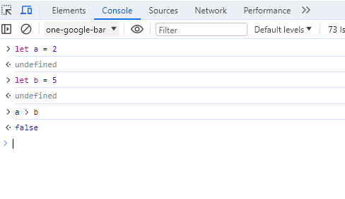

# JavaScript pour le web en 24 heures

## Prérequis
Connaître HTML/CSS ou avoir suivi un cours d'initiation à l'intégration web.

## Objectif
- S'initier à JavaScript par la pratique avec de petits exercices évolutifs. 
- S'aider de ce support et utiliser la doc en ligne pour une recheche plus approdondie.
- Utiliser ChatGPT : Un véritable assistant, si l'on maîtrise le prompt.

## Quelques bases du langage JavaScript
- Variables , tableaux, conditions , boucles, etc...


## Fonctionnalités liées au navigateur
- Sélectionner un ou plusieurs éléments
- Modifier le contenu ou le style d'un ou plusieurs éléments
- Cliquer sur un élément
- Lancer une fonction à intervalle de temps

## Où placer un programme Javascript 
### 1. Dans le document html, dans une paire de balises script.
```html
<head>
    <!-- après les liens css et balise meta -->
    <script>
        // ici le programme js
    </script>
</head>
``` 

### 2. Dans un fichier externe
Un fichier porte l’extension .js.   
Le fichier peut être dans l’entête du document en en fin de page  
 ```html 
<head>
    <!-- A noter le terme defer -->
    <script src=’js/app.js’ defer></script> 
</head>
```
Pour le dire simplement : le terme defer permet au navigateur de donner la priorité au chargement de la page web.

## Les commentaires d'un programme javascript
Avant de commencer l'initiation il est bon de savoir comment créer des commentaires dans un script.  

Ils ne servent qu'au développeur.
```js
    // commmentaire sur une ligne

    /*
        bloc de commentaire
        sur plusieurs
        lignes.
    */
```

## Comment Exécuter du Javascript

Il suffit de lancer la page web avec `liveserver` par exemple.  
Biensûr, il faut que le script soit intégré ou lié, comme vu précédement.

## Les premiers tests de variables
### 1. depuis le script
- on peut tester une variable avec la fonction `console.log()`
### 2. depuis la console du navigateur
Si vous faites un clic droit sur le navigateur, vous ouvrez un panneau inspecteur de tout ce qui est html, css et javascript.    
Pour inspecter du javascript, il faut aller dans l'onglet console. 
#### Nota bene 
Cet onglet est une bénédiction quand on débute en JS, car on peut tester directement des variables.  

Ici, par exemple, nous avons deux variables a et b. On demande si a est supérieur à b  .



